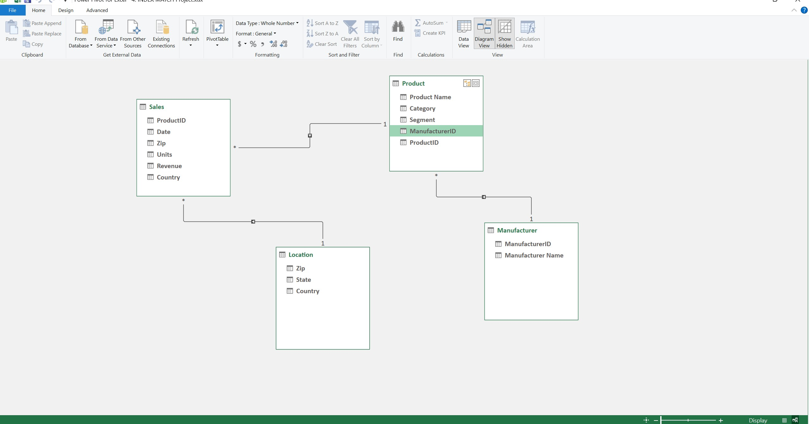

# Olufemi's_portfolio
Analytics Portfolio

## [Project 1: Wixsin Company Revenue Analysis](https://olufemigeorge.github.io/Wixsin_Company_Revenue_Analysis-MS_Excel/)
This project was completed during my internship at Quantum Analytics. I created an interactive dashboard using MS Excel and displayed the analytic findings for easy viewing and understanding.

Skills Demonstrated
The Following Microsoft Excel features were incorporated:
- Data Cleaning
- Data Consolidation with Index match
- Data Modelling with Power Pivot
- Pivot
- Visualisation chats
  
Dashboard           |Data Model with Power Pivot      |
:------------------:|:-------------------------------:|
     |         |
