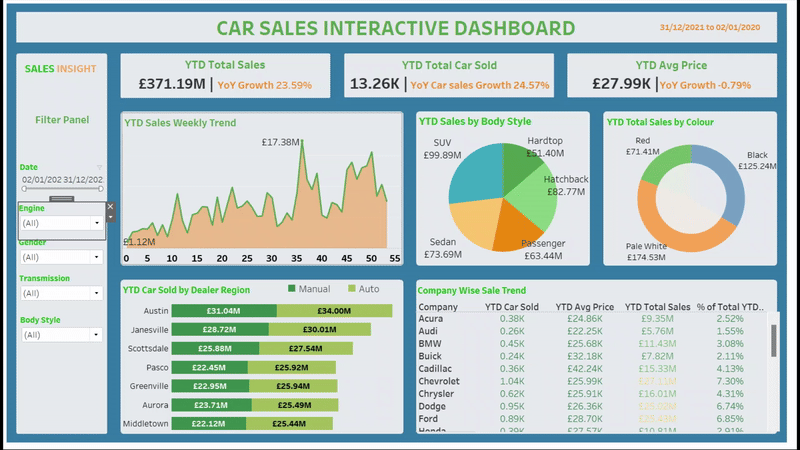

# Olufemi's_portfolio
Analytics Portfolio

## [Project 1: Wixsin Company Revenue Analysis](https://olufemigeorge.github.io/Wixsin_Company_Revenue_Analysis-MS_Excel/)
This project was completed during my internship at Quantum Analytics. I created an interactive dashboard using MS Excel and displayed the analytic findings for easy viewing and understanding.

Skills Demonstrated
The Following Microsoft Excel features were incorporated:
- Data Cleaning
- Data Consolidation with Index match
- Data Modelling with Power Pivot
- Pivot
- Visualisation chats
  
Dashboard           |Data Model with Power Pivot      |
:------------------:|:-------------------------------:|
     |         |

---

## [Project 1: Car Sales Dataset Analysis](https://olufemigeorge.github.io/Car_Sales_Dashboard/)
This is Tableau project analyses car sales data. In order to help the stakeholder make data-driven decisions, the project will analyse and extract real time insights to address important questions, monitor progress and identify trends opportunities for growth.

Skills demonstrated:

- Tableau Visualisation
- Tableau Calculations
- Power point

  

## [Project 1: Healthcare Patient Waitlist Analysis](https://olufemigeorge.github.io/Health_care_patient_waiting_list_vitualization-PowerBI/)
